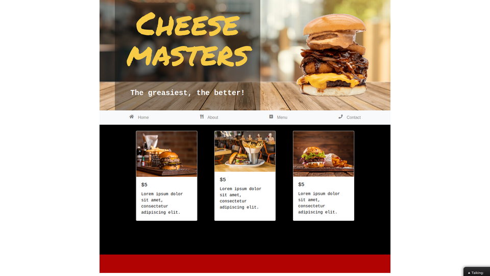

# Restaurant page

> This project consisted on building a simple restaurant page for practicing ES6. The aim of it was to strengthen our abilities with Webpack as well as manipulating objects in the DOM. The main feature is tabbed browsing section using a navbar.

## Live Demo

[Restaurant page](https://infallible-tereshkova-b41eed.netlify.app/#)

## Built With

- JavaScript(ES6)
- Webpack
- Bootstrap.

## Getting Started

- Run `git clone https://github.com/AlduLonghi/restaurant-page` to clone the repo.
- Run `npm install` to install the modules.
- Run `npm run watch`.
- Open index.html from the Dist folder.

## 👤 Author

- Github: [@AlduLonghi](https://github.com/AlduLonghi)
- Twitter: [@AbrilLonghi](https://twitter.com/AbrilLonghi )
- Linkedin: [Aldana Abril Longhi](https://www.linkedin.com/in/aldana-abril-longhi-a842ba1a7/ )

## 🤝 Contributing

- To contribute to this project:
- Fork this repository & clone locally.
- Create an upstream remote and sync your local copy.
- create a new branch.
- Push your code to your origin repository.
- Create a new Pull Request.

## Acknowledgments

- The Odin Project
- Microverse curriculum.

## Show your support

Give a ⭐️ if you like this project!